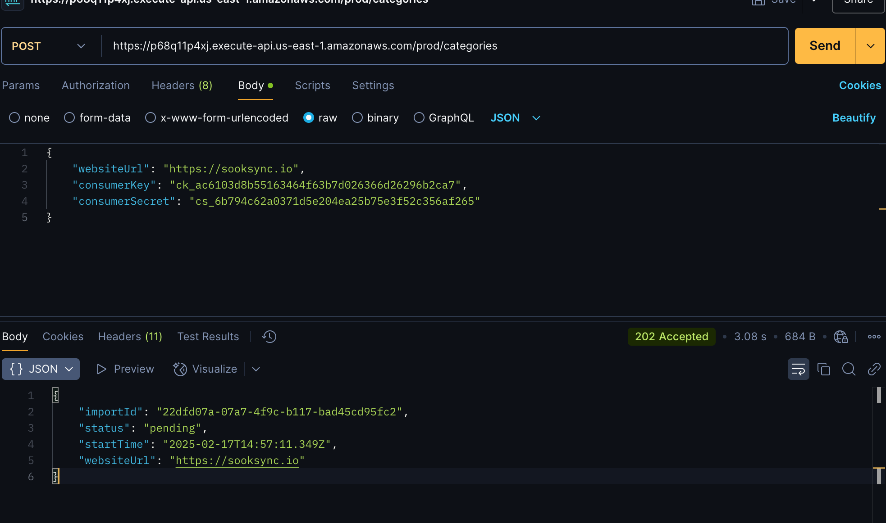
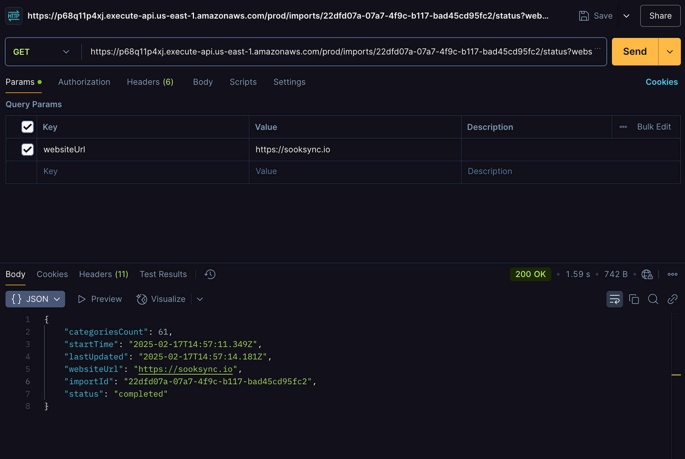
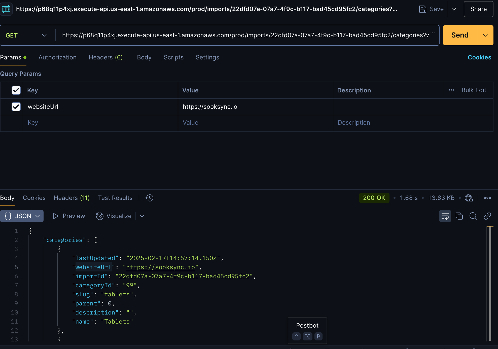
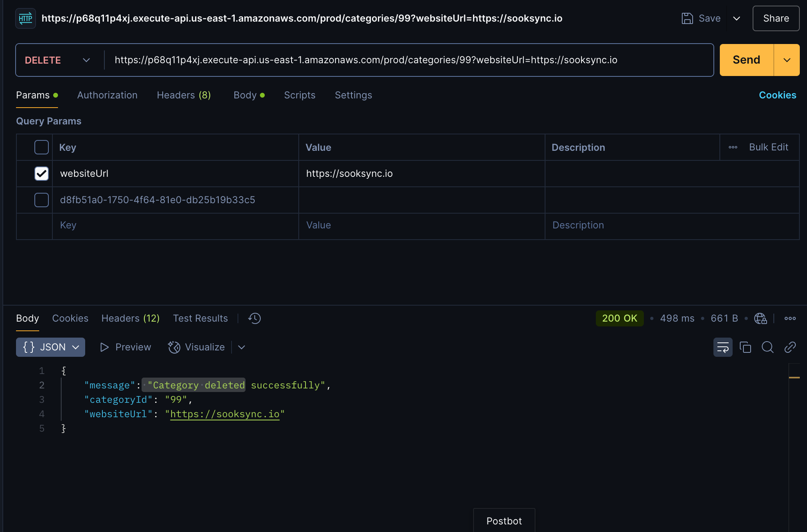

# WooCommerce Categories API

A serverless API for managing WooCommerce product categories. This solution allows you to import, manage, and track product categories from any WooCommerce website using AWS serverless technologies.

## High Level Architecture


This solution uses the following AWS services:
- API Gateway: RESTful API endpoints
- Lambda: Serverless compute
- DynamoDB: NoSQL database storage
- SQS: Message queue for asynchronous processing
- CloudWatch: Monitoring and logging
- WAF: Web Application Firewall (optional)

## Features
- Asynchronous import of WooCommerce categories
- Import status tracking
- Category management
- Rate limiting and error handling
- Comprehensive monitoring and alerting
- Secure API access with API keys

## Prerequisites
1. AWS CLI installed and configured
2. Node.js 18 or later
3. AWS CDK CLI installed
4. Valid AWS credentials with appropriate permissions

## Quick Start

1. Clone the repository:
```bash
git clone [repository-url]
cd woocommerce-categories-api
```

2. Create a `.env` file in the root directory:
```bash
AWS_REGION=us-east-1
STAGE=dev
STACK_NAME=woocommerce-categories-api
# Optional WooCommerce defaults
WOOCOMMERCE_URL=
WOOCOMMERCE_CONSUMER_KEY=
WOOCOMMERCE_CONSUMER_SECRET=
```

3. Install dependencies:
```bash
npm install
```

4. Deploy the infrastructure:
```bash
npm run deploy
```

## API Documentation

### Base URL
`https://{api-id}.execute-api.{region}.amazonaws.com/prod`

### Endpoints

1. **Import Categories**
   - POST `/categories`
   - Triggers a new import process
   - Request body example:
     ```json
     {
       "websiteUrl": "https://example.com",
       "consumerKey": "your-consumer-key",
       "consumerSecret": "your-consumer-secret"
     }
     ```

2. **Check Import Status**
   - GET `/imports/{importId}/status?websiteUrl=https://example.com`
   - Returns the current status of an import process

3. **Get Categories**
   - GET `/imports/{importId}/categories?websiteUrl=https://example.com`
   - Retrieves all categories from a specific import

4. **Delete Category**
   - DELETE `/categories/{categoryId}?websiteUrl=https://example.com`
   - Deletes a specific category

Full API documentation is available in OpenAPI format at `/docs/openapi.yaml`

## Local Development

1. Start the local development server:
```bash
npm run dev
```

2. Run tests:
```bash
npm test
```

3. Lint code:
```bash
npm run lint
```

## Deployment

### Automated Deployment (CI/CD)
The project includes GitHub Actions workflows for automated deployment:

Required GitHub Secrets:
- `AWS_ACCESS_KEY_ID`
- `AWS_SECRET_ACCESS_KEY`
- `AWS_REGION`

### Manual Deployment
```bash
# Deploy
./scripts/deploy.sh

# Destroy
./scripts/destroy.sh
```

## Monitoring and Maintenance

### CloudWatch Dashboards
- API Gateway metrics
- Lambda function metrics
- DynamoDB metrics
- SQS queue metrics

### Alerts
Configured alerts for:
- API Gateway 5xx errors
- Lambda function errors
- DynamoDB throttling
- SQS dead-letter queue messages

### Logging
- All Lambda functions log to CloudWatch
- Log retention: 30 days
- Structured logging using Winston

## Security

1. **API Security**
   - API Key required for all endpoints
   - Rate limiting: 100 requests per IP per 15 minutes
   - CORS configured
   - Input validation

2. **AWS Security**
   - Minimal IAM permissions
   - Encryption at rest
   - VPC endpoints (optional)
   - WAF protection (optional)


## Real-world testings






## Cost Optimization
- DynamoDB on-demand capacity
- Lambda function configurations optimized
- CloudWatch log retention policies
- AWS Free Tier compatible

## Troubleshooting

Common issues and solutions:

1. **Deployment Failures**
   - Verify AWS credentials
   - Check IAM permissions
   - Validate environment variables

2. **API Errors**
   - Check CloudWatch logs
   - Verify API key
   - Check rate limits

3. **Import Issues**
   - Verify WooCommerce credentials
   - Check SQS queue
   - Monitor Lambda timeouts

## Contributing
1. Fork the repository
2. Create a feature branch
3. Commit your changes
4. Push to the branch
5. Create a Pull Request

## License
This project is licensed under the MIT License - see the LICENSE file for details

## Support
For support, please:
1. Check the troubleshooting guide
2. Review CloudWatch logs
3. Open a GitHub issue

## Cleanup
To avoid unnecessary AWS charges:
```bash
./scripts/destroy.sh
```
