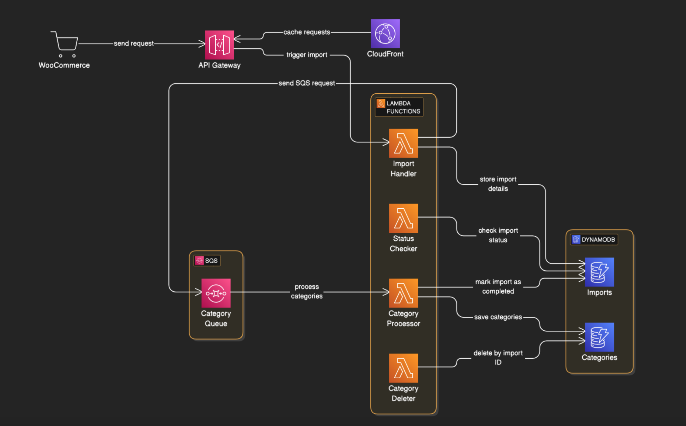

# Deployment Guide


## High level diagram


## Prerequisites

1. AWS CLI installed and configured
2. Node.js 18 or later
3. AWS CDK CLI installed
4. Valid AWS credentials with appropriate permissions

## Environment Setup

1. Create a `.env` file in the root directory:

```bash
AWS_REGION=us-east-1
STAGE=dev
STACK_NAME=woocommerce-categories-api
# Woocommerce
WOOCOMMERCE_URL=
WOOCOMMERCE_CONSUMER_KEY=
WOOCOMMERCE_CONSUMER_SECRET=
```

2. call deployment scripts in `scripts` directory:
- you can manually trigger the deployment / destroy scripts attached to the source


## Manual Deployment Steps

1. Install dependencies:
   ```bash
   npm install
   ```

2. Build the project:
   ```bash
   npm run build
   ```

3. Prepare AWS CDK:
   ```bash
   cdk bootstrap
   ```

4. Deploy to AWS:
   ```bash
   npm run deploy
   ```

## Automated Deployment (CI/CD)

The project includes a GitHub Actions workflow that automatically:
1. Runs tests
2. Checks code quality
3. Deploys to AWS (on main branch)

Required GitHub Secrets:
- AWS_ACCESS_KEY_ID
- AWS_SECRET_ACCESS_KEY
- AWS_REGION

## Post-Deployment Verification

1. Check AWS CloudFormation console for stack status
2. Verify API Gateway endpoints are accessible
3. Test sample requests using provided Postman collection
4. Monitor CloudWatch logs for any issues

## Monitoring and Maintenance

1. CloudWatch Dashboards:
   - API Gateway metrics
   - Lambda function metrics
   - DynamoDB metrics

2. Alerts are configured for:
   - API Gateway 5xx errors
   - Lambda function errors
   - DynamoDB throttling
   - SQS dead-letter queue messages

3. Logging:
   - All Lambda functions log to CloudWatch
   - Log retention set to 30 days
   - Structured logging using Winston

## Rollback Procedure

1. Automatic rollback:
   ```bash
   npm run deploy -- --version previous
   ```

2. Manual rollback:
   ```bash
   cdk deploy --version <version>
   ```

## Troubleshooting

Common issues and solutions:

1. Deployment fails with permissions error:
   - Verify AWS credentials
   - Check IAM role permissions

2. API returns 5xx errors:
   - Check Lambda function logs
   - Verify DynamoDB capacity

3. Import process stuck:
   - Check SQS queue for stuck messages
   - Verify Lambda concurrency limits

## Security Considerations

1. API Authentication:
   - API key required for all endpoints
   - Rate limiting enforced

2. Data Protection:
   - All data encrypted at rest
   - Secure parameter storage in SSM

3. Access Control:
   - Minimal IAM permissions
   - VPC endpoints for enhanced security

## Cost Optimization

1. Resources are configured for optimal cost:
   - DynamoDB on-demand capacity
   - Lambda function timeouts and memory optimized
   - CloudWatch log retention policies

2. Cost monitoring:
   - AWS Cost Explorer tags configured
   - Budget alerts set up

## Backup and Disaster Recovery

1. DynamoDB:
   - Point-in-time recovery enabled
   - Regular backups configured

2. Configuration:
   - Infrastructure as Code ensures reproducibility
   - State stored in S3 with versioning

3. Recovery procedures documented in runbooks